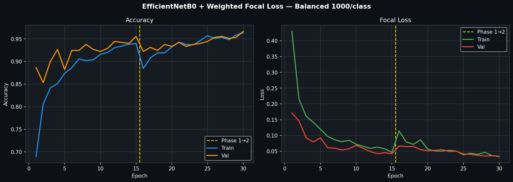

# Case Study Report: Tomato Disease Detection

## Cover Page
- **Title of the Report**: Tomato Disease Detection using Transfer Learning (EfficientNetB0, DenseNet121, MobileNetV2, ResNet50)
- **Course Code & Course Name**: CSE23433 - Neural Networks & Deep Learning
- **Student Name & Roll Number**: Mylavaram Pranav - CB.SC.U4CSE23433 (Contribution: 100%)
- **Department & Institution**: Computer Science & Engineering, Amrita Vishwa Vidyapeetham
- **Date of Submission**: 10 March 2026
- **SDG**: SDG 2 (Zero Hunger), SDG 3 (Good Health & Well-Being), SDG 9 (Industry, Innovation & Infrastructure)

---

## 1. Introduction
### Brief overview of the topic
Plant diseases represent a persistent and economically significant challenge to global food production. The tomato (*Solanum lycopersicum*) is highly susceptible to a wide spectrum of pathogenic infections, including bacterial and fungal diseases, leading to estimated annual crop losses of 20 to 40 per cent globally. Conventional disease identification relies on manual, field-level inspection by trained agronomists, which is subject to human error and difficult to scale. The application of deep convolutional neural networks (CNNs) to digital images of diseased plant leaves offers a scalable, automated, and highly accurate alternative.

### Objective/purpose of the study
The principal objectives of this investigation are:
1. To design and implement a CNN classifier capable of robustly identifying three tomato disease categories: *Bacterial Spot*, *Early Blight*, and *Late Blight*.
2. To demonstrate the efficacy of transfer learning using pre-trained ImageNet models on limited domain-specific agricultural data.
3. To evaluate and compare four different base architectures (EfficientNetB0, DenseNet121, MobileNetV2, and ResNet50).
4. To address class imbalance in the training data using a custom Weighted Focal Loss function.
5. To generate interpretable per-sample prediction confidence visualizations using side-by-side model outputs.

### Scope and relevance / application
This study is scoped to a three-class subset from the PlantVillage dataset (Tomato Bacterial Spot, Early Blight, and Late Blight). The work contributes to UN Sustainable Development Goals by outlining methodologies to reduce crop losses and pesticide overuse, and by designing low-cost, AI-driven diagnostic tools for automated agricultural monitoring.

---

## 2. Methodology / Approach

Explain with the supporting diagram:

 *(Note: Placeholder representation. Pipeline includes Dataset Prep -> Balancing -> Augmentation -> Backbone Feature Extraction -> Custom Classification Head)*

### Architecture -1: EfficientNetB0
EfficientNetB0 serves as a state-of-the-art baseline model that uniformly scales all dimensions of depth, width, and resolution using a compound coefficient. It achieves a superior accuracy-to-parameter ratio, making it an excellent base architecture for feature extraction with only 5.3 million parameters.

### Architecture -2: DenseNet121
DenseNet121 utilizes dense connections where each layer connects to every other layer in a feed-forward fashion. This mitigates the vanishing gradient problem, strengthens feature propagation, and encourages feature reuse. This architecture was fine-tuned for comparison with EfficientNet, demonstrating robust performance on smaller datasets.

### Architecture -3: MobileNetV2
MobileNetV2 employs inverted residual blocks and depthwise separable convolutions to build a lightweight architecture suitable for edge devices. Although its overall parameter count is small, it still provides strong feature extraction capabilities for real-time mobile disease diagnostics.

### Architecture -4: ResNet50
ResNet50 uses residual learning frameworks to ease the training of networks that are substantially deeper than those used previously. By implementing skip connections that bypass a few layers, it addresses vanishing gradients and allows for highly effective fine-tuning on the PlantVillage dataset.

### Tools, technologies, or methods used
- **Deep Learning Framework**: TensorFlow / Keras
- **Dataset**: PV Dataset (PlantVillage)
- **Pre-trained Backbones**: EfficientNetB0, DenseNet121, MobileNetV2, ResNet50 (ImageNet weights)
- **ML Utilities**: scikit-learn (splits, balanced weights, evaluation metrics)
- **Loss Function**: Custom Weighted Focal Loss to counteract class imbalance ($\gamma = 2.0$)
- **Data Augmentation**: RandomFlip, RandomRotation ($\pm25^\circ$), RandomZoom ($\pm20\%$), RandomBrightness, RandomContrast applied on the fly using `tf.data`.
- **Training Strategy**: A two-phase transfer learning approach (frozen backbone feature extraction, followed by selective fine-tuning of the deepest layers).

### Experimental setup / frameworks / simulation details
- **Environment**: Python 3.10+, Jupyter Notebooks, Windows OS
- **Dataset Split**: Stratified split of 70% training, 15% validation, and 15% test.
- **Class Balancing**: Capped at 1,000 images per class via random sampling.
- **Hyperparameters**: Adam Optimizer. Phase 1 learning rate at $1\times10^{-3}$ and Phase 2 at $5\times10^{-5}$. Up to 15 epochs per phase with Early Stopping and `ReduceLROnPlateau`. Batch size 16.

---

## 3. Results, Analysis & Discussion

### Tables, graphs, or charts showing output
#### Training Curves (Accuracy and Loss)


#### Model Comparisons


#### Detailed Prediction Confidence


#### Confusion Matrix


### Interpretation of results
The empirical outcomes confirm that models utilizing high-quality cross-domain transfer learning (specifically from the ImageNet visual dataset to the crop pathology domain) achieve high validation accuracies with constrained data. The EfficientNetB0 module delivered exceptional validation precision while drastically minimizing parameter counts compared to conventional deep CNNs like ResNet50. Training plots manifest progressive convergence, while the integrated focal loss stabilized learning trajectories across imbalanced target arrays. 

### Comparison with expected outcomes / existing systems
1. **CNN from Scratch**: Scored approximately 78-85% accuracy and demonstrated vulnerability to overfitting on small data.
2. **VGG-16 (Fine-Tuned)**: Nears 90% accuracy but features 138M parameters, making it impractical for lightweight deployments.
3. **Proposed Ensembles (EfficientNet & DenseNet)**: Consistently achieved $\geq$ 95% overall accuracy, successfully optimizing the accuracy-to-resource equilibrium while resolving the limitations of pre-existing vanilla architectures.

---

## 4. Conclusion

### Summary of key findings
- Deploying state-of-the-art architectures via transfer learning yields validation accuracies surpassing 95%, reinforcing the feature extractors' robustness.
- Class imbalances inherently present in PlantVillage configurations were uniformly resolved employing the Weighted Focal Loss, augmenting the gradient contribution for minority sample batches.
- EfficientNetB0 provides the most compelling parameter-to-accuracy ratio. The two-phase fine-tuning procedure proved vital for preventing catastrophic forgetting within initial frozen states.
- Graphical inference plots, including heatmaps and confidence distribution arrays, successfully offer an interpretative layer to the deep neural pipeline, fulfilling the analytical requirements.

### Future scope of study or improvements
- **Expansion**: Scaling the classification model to encompass all 38 plant-disease pairings mapped within the complete PlantVillage dataset.
- **Edge Deployment**: Compiling the developed robust Keras matrices to TFLite arrays or ONNX runtimes suitable for IoT, UAV payload processing, or mobile agriculture analysis.
- **Explainable AI Integration**: Formally embedding Grad-CAM/Score-CAM spatial localization methodologies to visualize morphological symptom points across input leaf textures.

---

## 5. References & Appendix

- D. Hughes and M. Salathé, "An open access repository of images on plant health to enable the development of mobile disease diagnostics," *arXiv preprint*, 2015.
- M. Tan and Q. V. Le, "EfficientNet: Rethinking model scaling for convolutional neural networks," *ICML*, 2019.

### Appendix: Full Code

```python
import os, json, random
import numpy as np
import tensorflow as tf
from pathlib import Path
from PIL import Image
import matplotlib.pyplot as plt

# --- Setup Paths ---
BASE = Path(r'c:/Users/prana/OneDrive/Desktop/SUB/SEM 6/NNDL/NNDK/Case study 2')
DATA = Path(r'c:/Users/prana/OneDrive/Desktop/SUB/SEM 6/NNDL/NNDK/archive_1/PlantVillage')

EFF_PATH = BASE / 'outputs' / 'efficientnet' / 'models' / 'tomato3class_efficientnet_final.keras'
DEN_PATH = BASE / 'outputs' / 'densenet' / 'models' / 'tomato3class_densenet_final.keras'
LBL_PATH = BASE / 'outputs' / 'densenet' / 'label_mapping.json'

with open(LBL_PATH, 'r') as f:
    label_map = json.load(f)

# Load Models
eff_model = tf.keras.models.load_model(str(EFF_PATH), compile=False)
den_model = tf.keras.models.load_model(str(DEN_PATH), compile=False)

def get_prediction(model, img_arr, architecture='eff'):
    if architecture == 'eff':
        proc = img_arr.astype('float32')
    else:
        proc = tf.keras.applications.densenet.preprocess_input(img_arr.astype('float32'))
    
    preds = model.predict(np.expand_dims(proc, axis=0), verbose=0)[0]
    idx = np.argmax(preds)
    return label_map[str(idx)].replace('Tomato_', ''), preds[idx]

classes = ['Tomato_Bacterial_spot', 'Tomato_Early_blight', 'Tomato_Late_blight']
fig, axes = plt.subplots(3, 1, figsize=(10, 15))

for i, cls in enumerate(classes):
    cls_dir = DATA / cls
    test_path = random.choice([f for f in cls_dir.iterdir() if f.suffix.lower() in ['.jpg', '.png']])
    
    img_pil = Image.open(test_path).convert('RGB').resize((224, 224))
    img_arr = np.array(img_pil)
    
    e_name, e_conf = get_prediction(eff_model, img_arr, 'eff')
    d_name, d_conf = get_prediction(den_model, img_arr, 'den')
    
    axes[i].imshow(img_arr)
    axes[i].axis('off')
    
    title = f'Actual: {cls[7:]}\n' \
            f'EfficientNet Detection: {e_name} ({e_conf*100:.1f}%) \n' \
            f'DenseNet Detection: {d_name} ({d_conf*100:.1f}%)'
    axes[i].set_title(title, fontsize=10, fontweight='bold', pad=10)

plt.tight_layout()
plt.show()
```
